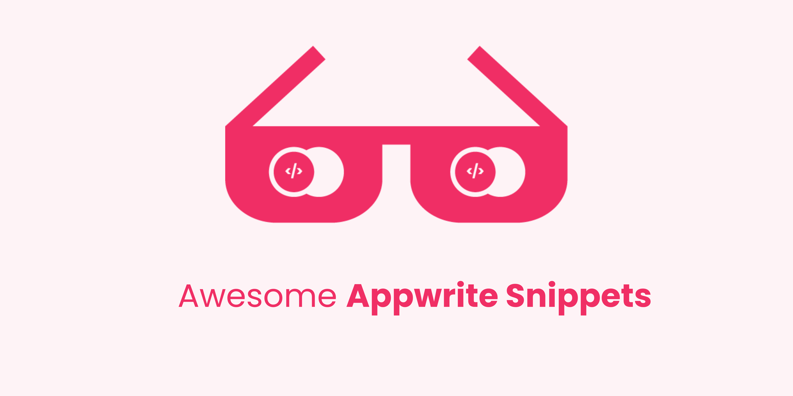

# Awesome Appwrite Snippets 
<!-- ALL-CONTRIBUTORS-BADGE:START - Do not remove or modify this section -->

<!-- ALL-CONTRIBUTORS-BADGE:END -->

Awesome Appwrite Snippets is a collection of commonly used Appwrite APIs. It increases your speed of development by eliminating most of the boilerplate code associated with making using Appwrite in your Project.

	
  
  

  

## Index

- [What is Appwrite](#what-is-appwrite)
- [Roadmap](#roadmap)
  - [Client Side](#client-side)
  - [Server Side](#server-side)
- [Rest API Snippets](#rest-api-snippets)
  - [Client](#client)
  - [Account](#account)
  - [Databases](#databases)
  - [Storage](#storage)
  - [Teams](#teams)
  - [Health](#health)
- [Known Issues](#known-issues)
- [Contributing](#contributing)
- [License](#license)

## What is Appwrite?

Appwrite is a self-hosted backend-as-a-service platform that provides developers with all the core APIs required to build any application.
To know more about appwrite, visit their [official website](https://appwrite.io).

## Roadmap

The following tables portrays the snippets of the following Appwrite API in their particular language is supported for now.

### Client Side

|   REST APIs   | Flutter SDK | Web SDK | Apple SDK | Android SDK (Java) | Android SDK (Kotlin) |
| :-----------: | ----------- | ------- | --------- | ------------------ | -------------------- |
|    Client     | ✅          | ✅      |           |                    |                      |
|    Account    | ✅          | ✅      |           |                    |                      |
|   Database    | ✅          | ✅      |           |                    |                      |
|    Storage    | ✅          | ✅      |           |                    |                      |
|     Teams     | ✅          | ✅      |           |                    |                      |
|   Functions   |             |         |           |                    |                      |
| Localizations |             |         |           |                    |                      |
|    Avatars    |             |         |           |                    |                      |

### Server Side

|   REST APIs   | Dart | Node.js | Swift | Deno | Python | Ruby | PHP | Kotlin |
| :-----------: | ---- | ------- | ----- | ---- | ------ | ---- | --- | ------ |
|    Client     | ✅   |         |       |      |        |      |     |        |
|    Account    | ✅   |         |       |      |        |      |     |        |
|   Database    |      |         |       |      |        |      |     |        |
|    Storage    |      |         |       |      |        |      |     |        |
|     Teams     |      |         |       |      |        |      |     |        |
|   Functions   |      |         |       |      |        |      |     |        |
| Localizations |      |         |       |      |        |      |     |        |
|    Avatars    |      |         |       |      |        |      |     |        |
|    Health     |      |         |       |      |        |      | ✅  |        |
|     Users     |      |         |       |      |        |      |     |        |

These snippets supports for the appwrite version 

## Rest API Snippets

The Appwrite API is organized around REST. Their API has predictable resource-oriented URLs, accepts form-encoded or JSON-encoded request bodies, returns JSON-encoded responses, and uses standard HTTP response codes, authentication, and verbs.

### Client

| Shortcut  | Description                                     |
| :-------: | ----------------------------------------------- |
| `client`  | Create a Client object and initialize it        |
| `sclient` | Create a server Client object and initialize it |

### Account

The Account service allows you to authenticate and manage a user account. You can use the account service to update user information, retrieve the user sessions across different devices, and fetch the user security logs with his or her recent activity. To know more about Accounts API, head over this [page](https://appwrite.io/docs/client/account)

|                           Shortcut                            | Description                                                                                                                                                                                                                                                                                                                                                                                                                                                                                                                                                                               |
| :-----------------------------------------------------------: | ----------------------------------------------------------------------------------------------------------------------------------------------------------------------------------------------------------------------------------------------------------------------------------------------------------------------------------------------------------------------------------------------------------------------------------------------------------------------------------------------------------------------------------------------------------------------------------------- |
|                           `account`                           | Create and Account object and initialize it                                                                                                                                                                                                                                                                                                                                                                                                                                                                                                                                               |
|                 `crAccount`, `createAccount`                  | Allow a new user to register a new account in your project.                                                                                                                                                                                                                                                                                                                                                                                                                                                                                                                               |
|                       `crsessionOAuth2`                       | Create a new Account session with OAuth2                                                                                                                                                                                                                                                                                                                                                                                                                                                                                                                                                  |
|                  `magicUrl`, `mgURLSession`                   | Sends the user an email with a secret key for creating a session.When the user clicks the link in the email, the user is redirected back to the URL you provided with the secret key and userId values attached to the URL query string.                                                                                                                                                                                                                                                                                                                                                  |
|        `upMagicUrl`, `updatemagicUrl`, `mgURLSession`         | Update Magic URL session                                                                                                                                                                                                                                                                                                                                                                                                                                                                                                                                                                  |
|               `crsPhone`, `createPhoneSession`                | Create a new Phone session                                                                                                                                                                                                                                                                                                                                                                                                                                                                                                                                                                |
|                `upPhone`, `updatePhoneSession`                | Update the Phone session                                                                                                                                                                                                                                                                                                                                                                                                                                                                                                                                                                  |
|     `crsAccount`, `crAnonymous`, `createAnonymousSession`     | Create a new Anonymous Session                                                                                                                                                                                                                                                                                                                                                                                                                                                                                                                                                            |
|                        `crJWT`, `JWT`                         | Create a new Account using JWT                                                                                                                                                                                                                                                                                                                                                                                                                                                                                                                                                            |
|                         `getAccount`                          | Get currently logged in user data as JSON object.                                                                                                                                                                                                                                                                                                                                                                                                                                                                                                                                         |
|            `getAccountPreferences`, `getAccPrefs`             | Get currently logged in user preferences as a key-value object.                                                                                                                                                                                                                                                                                                                                                                                                                                                                                                                           |
|             `getAccountSession`, `getAccSession`              | Get currently logged in user list of active sessions across different devices.                                                                                                                                                                                                                                                                                                                                                                                                                                                                                                            |
|                 `getAccountLogs`, `getAccLog`                 | Get currently logged in user list of latest security activity logs. Each log returns user IP address, location and date and time of log.                                                                                                                                                                                                                                                                                                                                                                                                                                                  |
|               `getSessionId`, `getSessionbyId`                | Use this endpoint to get a logged in user's session using a Session ID. Inputting 'current' will return the current session being used.                                                                                                                                                                                                                                                                                                                                                                                                                                                   |
|                    `updateName`, `upName`                     | Update currently logged in user account name.                                                                                                                                                                                                                                                                                                                                                                                                                                                                                                                                             |
|                  `updatePassword`, `upPass`                   | Update currently logged in user password. For validation, user is required to pass in the new password, and the old password. For users created with OAuth and Team Invites, oldPassword is optional.                                                                                                                                                                                                                                                                                                                                                                                     |
|                   `updateEmail`, `upEmail`                    | Update currently logged in user account email address. After changing user address, the user confirmation status will get reset. A new confirmation email is not sent automatically however you can use the send confirmation email endpoint again to send the confirmation email. For security measures, user password is required to complete this request.                                                                                                                                                                                                                             |
|                      `upPrefs`, `upPref`                      | Update currently logged in user account preferences. The object you pass is stored as is, and replaces any previous value. The maximum allowed prefs size is 64kB and throws error if exceeded.                                                                                                                                                                                                                                                                                                                                                                                           |
|                   `deleteAccount`, `delAcc`                   | Delete a currently logged in user account. Behind the scene, the user record is not deleted but permanently blocked from any access. This is done to avoid deleted accounts being overtaken by new users with the same email address. Any user-related resources like documents or storage files should be deleted separately.                                                                                                                                                                                                                                                            |
|            `deleteAccountSession`, `delAccSession`            | Use this endpoint to log out the currently logged in user from all their account sessions across all of their different devices. When using the option id argument, only the session unique ID provider will be deleted.                                                                                                                                                                                                                                                                                                                                                                  |
|           `deleteAccountSessions`, `delAccSessions`           | Delete all sessions from the user account and remove any sessions cookies from the end client.                                                                                                                                                                                                                                                                                                                                                                                                                                                                                            |
|                  `recPassword`, `crRecovery`                  | Sends the user an email with a temporary secret key for password reset. When the user clicks the confirmation link he is redirected back to your app password reset URL with the secret key and email address values attached to the URL query string. Use the query string params to submit a request to the PUT /account/recovery endpoint to complete the process. The verification link sent to the user's email address is valid for 1 hour.                                                                                                                                         |
|                `upRecovery`, `updateRecovery`                 | Sends the user an email with a temporary secret key for password reset. When the user clicks the confirmation link he is redirected back to your app password reset URL with the secret key and email address values attached to the URL query string. Use the query string params to submit a request to the PUT /account/recovery endpoint to complete the process. The verification link sent to the user's email address is valid for 1 hour.                                                                                                                                         |
|          `emailVerification`, `crEmailVerification`           | Use this endpoint to send a verification message to your user email address to confirm they are the valid owners of that address. Both the userId and secret arguments will be passed as query parameters to the URL you have provided to be attached to the verification email. The provided URL should redirect the user back to your app and allow you to complete the verification process by verifying both the userId and secret parameters. Learn more about how to complete the verification process. The verification link sent to the user's email address is valid for 7 days. |
| `emailVerificationconfirmation`, `crEmailVerificationconfirm` | Use this endpoint to complete the user email verification process. Use both the userId and secret parameters that were attached to your app URL to verify the user email ownership. If confirmed this route will return a 200 status code.                                                                                                                                                                                                                                                                                                                                                |
|          `phoneVerification`, `crPhoneVerification`           | Use this endpoint to send a verification SMS to the currently logged in user. This endpoint is meant for use after updating a user's phone number using the accountUpdatePhone endpoint. Learn more about how to complete the verification process. The verification code sent to the user's phone number is valid for 15 minutes.                                                                                                                                                                                                                                                        |
| `phoneVerificationconfirmation`, `crPhoneVerificationconfirm` | Use this endpoint to complete the user phone verification process. Use the userId and secret that were sent to your user's phone number to verify the user email ownership. If confirmed this route will return a 200 status code.                                                                                                                                                                                                                                                                                                                                                        |

### Databases

The Databases service allows you to create structured collections of documents, query and filter lists of documents, and manage an advanced set of read and write access permissions.

All data returned by the Databases service are represented as structured JSON documents. To know more about Databases API, head over this [page](https://appwrite.io/docs/client/databases)

| Shortcut                   | Description                                                                                                                                                                   |
| -------------------------- | ----------------------------------------------------------------------------------------------------------------------------------------------------------------------------- |
| `database`                 | Create a Database object and initialize it.                                                                                                                                   |
| `crdoc`, `crDocument`      | Create a new Document. Before using this route, you should create a new collection resource using either a server integration API or directly from your database console.     |
| `lsdoc`, `lsd`             | Get a list of all the user documents. You can use the query params to filter your results. On admin mode, this endpoint will return a list of all of the project's documents. |
| `getDocument`              | Get a document by its unique ID. This endpoint response returns a JSON object with the document data.                                                                         |
| `updateDocument`           | Update a document by its unique ID. Using the patch method you can pass only specific fields that will get updated.                                                           |
| `deleteDocument`, `deldoc` | Delete a document by its unique ID. This endpoint deletes only the parent documents, its attributes and relations to other documents. Child documents will not be deleted.    |

### Storage

The Storage service allows you to manage your project files. Using the Storage service, you can upload, view, download, and query all your project files.
To know more about Storage API, head over this [page](https://appwrite.io/docs/client/storage)

| Shortcut             | Description                                                                                                                                                               |
| -------------------- | ------------------------------------------------------------------------------------------------------------------------------------------------------------------------- |
| `storage`            | Create a Database object and initialize it.                                                                                                                               |
| `createFile`         | Create a new file. The user who creates the file will automatically be assigned to read and write access unless he has passed custom values for read and write arguments. |
| `listFiles`          | Get a list of all the user files. You can use the query params to filter your results. On admin mode, this endpoint will return a list of all of the project's files.     |
| `getFile`            | Get a file by its unique ID.                                                                                                                                              |
| `getFilePreview`     | Get a file preview by its unique ID.                                                                                                                                      |
| `getFileForDownload` | Get a file for download by its unique ID.                                                                                                                                 |
| `getFileForView`     | Get a file content by its unique ID. This endpoint is similar to the download method but returns with no 'Content-Disposition: attachment' header.                        |
| `updateFile`         | Update a file by its unique ID. Only users with write permissions have access to update this resource.                                                                    |
| `deleteFile`         | Delete a file by its unique ID. Only users with write permissions have access to delete this resource.                                                                    |

### Teams

The Teams service allows you to group users of your project and to enable them to share read and write access to your project resources, such as database documents or storage files.
To know more about Teams API, head over this [page](https://appwrite.io/docs/client/teams)

| Shortcut                                    | Description                                                                                                                                                                                               |
| ------------------------------------------- | --------------------------------------------------------------------------------------------------------------------------------------------------------------------------------------------------------- |
| `team`                                      | Create a Team object and initialize it.                                                                                                                                                                   |
| `createTeam`, `crTeam`                      | Create a new Team.                                                                                                                                                                                        |
| `listTeams`, `listTeams`                    | Get a list of all the user teams. You can use the query params to filter your results. On admin mode, this endpoint will return a list of all of the project's teams.                                     |
| `getTeam`                                   | Get a team by its unique ID.                                                                                                                                                                              |
| `updateTeam`,`upTeam`                       | Update a team by its unique ID.                                                                                                                                                                           |
| `deleteTeam`, `delTeam`                     | Delete a team by its unique ID.                                                                                                                                                                           |
| `createTeamMembership`, `crTeamMembership`  | Create a new Team Membership.                                                                                                                                                                             |
| `getTeamMembership`, `gtmembership`         | Get a team membership by its unique ID.                                                                                                                                                                   |
| `updateTeamMembershiproles`                 | Modify the roles of a team member. Only team members with the owner role have access to this endpoint.                                                                                                    |
| `updateTeamMembershipstatus`                | Use this endpoint to allow a user to accept an invitation to join a team after being redirected back to your app from the invitation email received by the user.                                          |
| `deleteTeamMembership`, `delTeamMembership` | This endpoint allows a user to leave a team or for a team owner to delete the membership of any other team member. You can also use this endpoint to delete a user membership even if it is not accepted. |

### Health

The Health service is designed to allow you to both validate and monitor that your Appwrite server instance and all of its internal components are up and responsive.
To know more about Health API, head over this [page](https://appwrite.io/docs/server/health)

| Shortcut                                    | Description                                                                                                                                 |
| ------------------------------------------- | ------------------------------------------------------------------------------------------------------------------------------------------- |
| `health`                                                        | Create a Health object and initialize it.                                                                               |
| `getHttp`, `getHealth`                                          | Check the Appwrite HTTP server is up and responsive.                                                                    |
| `getDbHealth`, `getDatabaseHealth`                              | Check the Appwrite database server is up and connection is successful.                                                  |
| `getCacheHealth`                                                | Check the Appwrite in-memory cache server is up and connection is successful.                                           |
| `getTime`,`getTimeHealth`                                       | Check the Appwrite server time is synced with Google remote NTP server.                                                 |
| `getWebhooksQueue`, `getWhQueue`, `getQueueWebhooks`            | Get the number of webhooks that are waiting to be processed in the Appwrite internal queue server.                      |
| `getLogsQueue`, `getQueueLogs`                                  | Get the number of logs that are waiting to be processed in the Appwrite internal queue server.                          |
| `getCertificatesQueue`, `getCertsQueue`, `getQueueCertificates` | Get the number of certificates that are waiting to be issued against Letsencrypt in the Appwrite internal queue server. |
| `getFuncsQueue`, `getFunctionsQueue`, `getQueueFunctions`       | Get the number of function executions that are waiting to be executed.                                                  |
| `getStorageHealth`, `getStorageLocal`                           | Check the Appwrite local storage device is up and connection is successful.                                             |
| `getAntivirusHealth`, `getAntivirus`                            | Check the Appwrite Antivirus server is up and connection is successful.                                                 |

## Known Issues

At this time, there are no known issues. If you discover a bug or would like to see a shortcut added, please create a pull request at our GitHub page.

## Contributing

Contributions are highly Welcomed 💙 . Feel free to open PRs for small issues such as typos. For large issues or features, please open an issue and wait for it to be assigned to you.

See [`contributing.md`](CONTRIBUTING.md) for ways to get started.

Please adhere to this project's [Code of Conduct](CODE_OF_CONDUCT.md).

## License

This project is MIT licensed. See [`LICENSE`](LICENSE) for more details

## Contributors ✨

Thanks goes to these wonderful people ([emoji key](https://allcontributors.org/docs/en/emoji-key)):

<!-- ALL-CONTRIBUTORS-LIST:START - Do not remove or modify this section -->
<!-- prettier-ignore-start -->
<!-- markdownlint-disable -->
<table>
  <tbody>
    <tr>
      <td align="center"><a href="https://github.com/Nikhil-1503"> <b>Nikhil Shanbhag</b></a> <a href="#maintenance-Nikhil-1503" title="Maintenance">🚧</a></td>
      <td align="center"><a href="https://www.linkedin.com/in/pranjal-mishra-3a79b0196/"> <b>Pranjal Mishra</b></a> <a href="#maintenance-Pranjalmishra30" title="Maintenance">🚧</a></td>
      <td align="center"><a href="http://matejbaco.eu"> <b>Matej Bačo</b></a> <a href="https://github.com/2002Bishwajeet/awesome-appwrite-snippets/commits?author=Meldiron" title="Code">💻</a> <a href="https://github.com/2002Bishwajeet/awesome-appwrite-snippets/commits?author=Meldiron" title="Documentation">📖</a></td>
    </tr>
  </tbody>
</table>

<!-- markdownlint-restore -->
<!-- prettier-ignore-end -->

<!-- ALL-CONTRIBUTORS-LIST:END -->

This project follows the [all-contributors](https://github.com/all-contributors/all-contributors) specification. Contributions of any kind welcome!